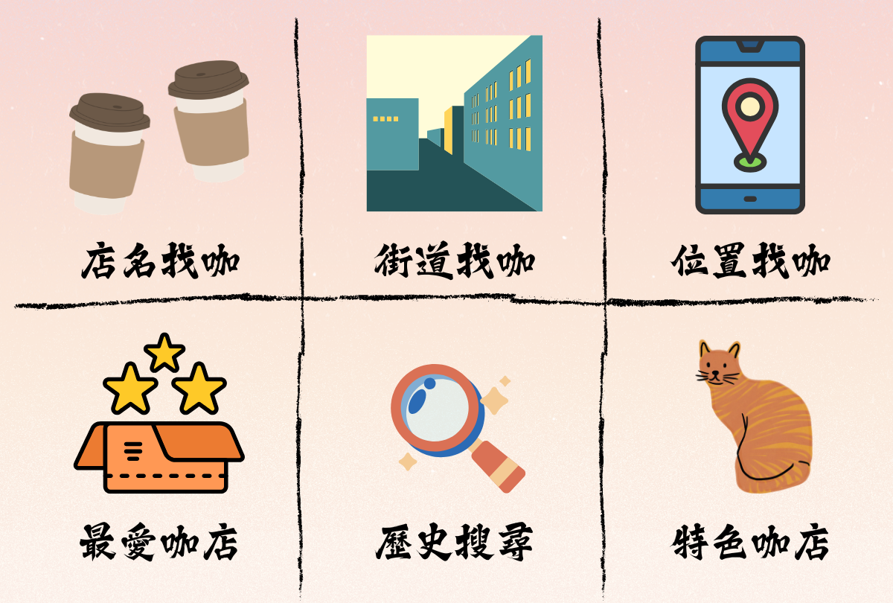
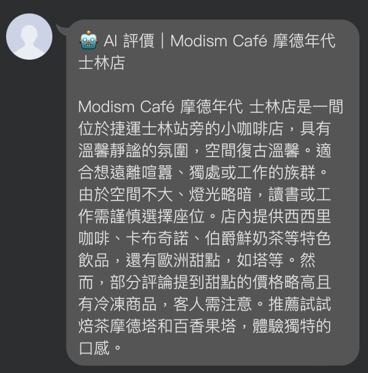
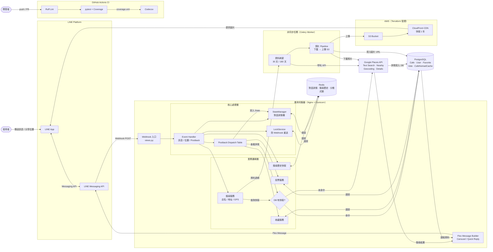

# Find Coffee

[](https://github.com/KK-Huang86/Find_Coffee/actions/workflows/ci.yml)
[](https://codecov.io/gh/KK-Huang86/Find_Coffee)

透過 LINE Bot 搜尋台灣咖啡店的服務。使用者可依店名、地址、當前位置或行政區查詢咖啡店，並提供收藏、評價等個人化功能。



---

## 目錄

- [專案目標與功能](#專案目標與功能)
- [系統架構圖](#系統架構圖)
- [操作流程](#操作流程)
- [使用技術](#使用技術)
- [快速啟動](#快速啟動)
- [Terraform（AWS 基礎設施）](#terraformaws-基礎設施)
- [專案架構](#專案架構)
- [技術亮點](#技術亮點)
- [未竟之事](#未竟之事)

---

## 專案目標與功能

### 開發動機

咖啡店搜尋散落在 Google Maps、咖啡相關網站等不同平台，且不同需求（不限時、有插座、寵物友善）難以一次過濾。本專案以 LINE Bot 為介面，整合 Google Places API 與社群投票資料，讓使用者在日常使用的通訊軟體中即可完成查詢。

### 解決的痛點

想找一間有插座、不限時的咖啡店坐下來工作，卻得在 Google Maps、咖啡地圖、各種網站之間來回切換比對——這是 Find Coffee 想解決的問題。

只要打開平常就在用的 LINE，不需安裝任何 App，就能直接查詢附近的咖啡店，並一眼看到該店是否不限時、有無插座，省去逐一確認的時間。

資料品質同樣是痛點。Google Maps 的資訊往往不夠細緻，且容易過時。Find Coffee 讓使用者可以對每間店的屬性投票，集合眾人之力補充真實的使用體驗，後台也會定期自動更新資料，確保看到的資訊不會是幾年前的舊資料。

### 主要功能

**搜尋**
- 依店名搜尋：呼叫 Google Places Text Search API，同時查本地資料庫快取
- 依地址搜尋：輸入路名，以 Geocoding API 轉換座標後查詢附近咖啡店
- 分享位置搜尋：使用者分享 GPS 座標，直接查詢半徑範圍內的咖啡店

**個人化**
- 收藏咖啡店：加入 / 移除收藏，收藏清單支援分頁瀏覽（每頁 15 筆）
- 最近搜尋：記錄最近的搜尋關鍵字，可快速重新查詢
- 咖啡店評價：使用者可對插座、限時、安靜程度、價格、寵物友善等屬性投票

**篩選**
- 工作友善：過濾不限時且有插座的店家，支援依行政區搜尋
- 寵物相關：篩選店內有貓貓狗狗，或寵物友善的店家

**AI 評價**
- 串接 Groq API（llama-3.3-70b-versatile），根據 Google Places 評論自動生成咖啡店 AI 摘要
- AI 評價結果以 Redis 快取 7 天，相同店家重複查詢不消耗額度
- 每位使用者有獨立的月用量限制，防止濫用



**資料維護**
- 咖啡店資料定期刷新（30 天），照片每 180 天重新拉取
- 近鄰搜尋使用貝葉斯加權評分排序，避免評論數過少的店家排名過高

---

## 系統架構圖



---

## 操作流程

🎬 **操作影片**：[YouTube Demo](https://youtu.be/1CN9ZE2MW10)

1. 加入 LINE Bot 好友
2. 透過 Rich Menu 選擇功能（店名查詢、位置分享、我的收藏等）
3. 根據單一咖啡店進行查詢
4. 收藏咖啡店
5. 根據街道查詢附近咖啡店
6. 分享給好友
7. 分享位置查詢附近咖啡店
8. 查詢收藏的咖啡店
9. 歷史查詢紀錄
10. 查詢區域工作友善咖啡店
11. 針對個別咖啡店進行評論
12. 查看 AI 評價摘要

---

## 使用技術

| 類別 | 技術 |
|------|------|
| 後端框架 | Django 6.0 / Python 3.13 |
| 資料庫 | PostgreSQL |
| 快取 / 狀態管理 | Redis |
| 非同步任務 | Celery |
| LINE Bot SDK | line-bot-sdk-python v3 (Messaging API) |
| 外部 API | Google Places API（Text Search、Nearby Search、Geocoding、Place Details） |
| AI | Groq API（llama-3.3-70b-versatile） |
| 雲端儲存 | AWS S3 + CloudFront |
| 基礎設施 | Terraform |
| 容器化 | Docker / Docker Compose |
| 網頁伺服器 | Nginx + Gunicorn |
| 套件管理 | uv |
| 測試 | pytest / pytest-django |
| CI | GitHub Actions |
| 程式碼風格 | pre-commit（trailing whitespace / end-of-file / line ending） |

---

## 快速啟動

### 環境需求

- Python 3.13+
- Docker / Docker Compose
- uv

### 環境變數

複製 `.env.example` 並填入對應的值：

```bash
cp .env.example .env
```

主要需設定的變數：

```
LINE_CHANNEL_ACCESS_TOKEN=
LINE_CHANNEL_SECRET=
GOOGLE_API_KEY=
DATABASE_URL=
REDIS_URL=
AWS_ACCESS_KEY_ID=
AWS_SECRET_ACCESS_KEY=
S3_BUCKET_NAME=
CLOUDFRONT_DOMAIN=
```

### 以 Docker Compose 啟動

```bash
docker compose up --build
```

### 本地開發

```bash
# 安裝依賴
uv sync

# 執行 migration
uv run python manage.py migrate

# 啟動開發伺服器
uv run python manage.py runserver

# 執行測試
uv run pytest
```

---

## Terraform（AWS 基礎設施）

S3 Bucket 與 CloudFront CDN（照片儲存與分發）由 `terraform/` 定義與管理，State 存於遠端 S3 backend（`find-coffee-terraform-state`）。

### 設定變數

複製 `terraform.tfvars.example` 並填入對應的值：

```bash
cd terraform
cp terraform.tfvars.example terraform.tfvars
```

需要設定的變數：

```
aws_region     = "ap-northeast-1"
project_name   = "find-coffee"
environment    = "production"
s3_bucket_name = ""   # 必填，須全球唯一，建議與 .env 的 S3_BUCKET_NAME 保持一致
```

`terraform.tfvars` 已列在 `.gitignore`，不會被 commit。

### AWS 憑證

Terraform 不會從 `.tfvars` 或 `.env` 讀取 AWS 憑證，`provider.tf` 中的 `aws` provider 依標準憑證鏈尋找，例如：

```bash
export AWS_ACCESS_KEY_ID=xxx
export AWS_SECRET_ACCESS_KEY=xxx
# 或使用 aws configure 設定的 profile
```

### 常用指令

```bash
cd terraform
terraform init
terraform fmt -check
terraform validate
terraform plan
terraform apply
```

---

## 專案架構

```
Find_Coffee/
├── cafe/                   # 咖啡店核心資料
│   ├── models.py           # Cafe、Favorite、CafeAttributeVote、CafeNomadCache 模型
│   ├── tasks.py            # Celery 非同步任務（照片下載 / 上傳 S3、資料刷新）
│   └── services/
│       ├── vote_service.py       # 屬性投票邏輯
│       └── attribute_matcher.py  # 依投票結果計算咖啡店屬性
│
├── line_bot/               # LINE Bot 核心邏輯
│   ├── views.py            # Webhook 入口、Rich Menu 設定
│   ├── event_handlers.py   # 訊息 / 位置 / Postback 事件處理
│   ├── state.py            # 對話狀態管理（Redis）
│   ├── constants.py        # UserState、MenuAction、投票選項等常數
│   ├── handlers/
│   │   ├── postback_actions.py   # 所有 Postback action handler（dispatch table 架構）
│   │   └── helpers.py            # 取得 / 建立咖啡店資料的共用邏輯
│   ├── builders/
│   │   ├── flex_builder.py           # 相容層（re-export，實作已搬至下列各模組）
│   │   ├── shop_flex_message.py      # 店家 Flex Message 組裝
│   │   ├── message_sender.py         # 組裝並發送店家搜尋結果
│   │   ├── postback.py               # 店家操作 postback 組裝
│   │   ├── favorites_page.py         # 收藏清單分頁訊息組裝
│   │   └── quick_reply.py            # Quick Reply 組裝
│   └── services/
│       └── search_cache.py       # 搜尋歷史紀錄（Redis）
│
├── integrations/
│   └── google/
│       └── api.py          # Google Places API（文字搜尋、附近搜尋、地址轉座標、店家詳情）
│
├── users/                  # 使用者模型與收藏管理
│   ├── models.py
│   └── views.py            # FavoritesManager（加入 / 移除收藏）
│
├── utils/
│   └── utils.py            # LockService（Redis 分散式鎖）
│
├── core/                   # Django 設定
├── nginx/                  # Nginx 設定
└── terraform/              # AWS 資源定義（S3、CloudFront）
```

---

## 技術亮點

### 1. Postback Dispatch Table

Postback 事件以 `action=xxx` 作為路由鍵，透過字典 dispatch table 分派到對應 handler，取代巢狀 if-else。新增功能只需掛載至字典，不需修改主流程。

```python
ACTION_HANDLERS = {
    'favorite': handle_favorite,
    'unfavorite': handle_unfavorite,
    'view_detail': handle_view_detail,
    'vote': handle_vote,
    'vote_answer': handle_vote_answer,
    'next_page': handle_next_page,
    ...
}
```

### 2. Redis 分散式鎖防止重複請求

LINE Webhook 在網路不穩時可能短時間內重送相同事件。`LockService` 以 Redis `SETNX` 實作輕量鎖，對每個使用者的操作設定 TTL，確保同一動作不會被重複處理。

```python
class LockService:
    @staticmethod
    def acquire(user_id, action, ttl=2):
        key = f'lock:{user_id}:{action}'
        return cache.add(key, 1, ttl)
```

### 3. Redis 對話狀態機

使用者與 Bot 的多步驟互動（輸入店名、逐題回答投票）需要跨訊息維護狀態。`StateManager` 將狀態與 context 存於 Redis，支援複數步驟的互動流程，並在流程結束後清除。

### 4. 貝葉斯加權評分排序

位置搜尋（分享座標 / 輸入地址）呼叫 Google Places Nearby Search 後，回傳結果不直接以 Google 評分排序，而是引入貝葉斯平均，對評論數較少的店家給予懲罰，避免只有少數高分評論的店排在前面，最終取加權評分最高的前 10 筆回傳。

```
weighted_rating = (C * m + n * r) / (C + n)
# C: 最低評論門檻，m: 全體平均評分，n: 實際評論數，r: 實際評分
```

本地資料庫的查詢排序（行政區搜尋、篩選結果）則依 `favorite_count`、`user_ratings_total` 排序，兩者為不同情境。

### 5. 咖啡店資料快取與自動刷新

首次查詢後將咖啡店資料存入本地資料庫，後續查詢優先讀取快取。當資料超過 30 天未更新，觸發 Celery 非同步任務重新呼叫 Google API；照片超過 180 天則重新下載並上傳 S3，舊連結同步清除。

### 6. 照片 Pipeline（Google Photos → S3 → CloudFront）

直接在 LINE Flex Message 嵌入 Google Places 照片 URL 有時效限制。改以 Celery worker 非同步下載後上傳至 S3，透過 CloudFront CDN 提供穩定的長效圖片連結，並設定一年快取。

### 7. 社群投票屬性系統

使用者可對插座、限時、安靜程度、寵物友善等屬性投票，資料存於 `CafeAttributeVote`。`VoteService` 彙整多筆投票後更新咖啡店屬性，並設有唯一約束防止重複投票。

### 8. API 用量追蹤與使用者限流

針對會呼叫付費外部 API 的操作（如 Google Places 搜尋），以資料庫記錄每位使用者的呼叫次數與時間。當單一使用者在特定時間窗內超過用量門檻時，拒絕後續請求並回傳提示，避免 API 成本被單一使用者過度消耗，也防止惡意濫用。此機制與防止 Webhook 重送的 `LockService` 為不同層次的保護：前者針對使用者行為，後者針對系統事件。

### 9. Groq AI 評價與 Redis 快取

串接 Groq API 對咖啡店進行 AI 摘要評價。為避免重複呼叫 API，評價結果以 Redis 快取 7 天，同一間店在快取期間內無論多少人查詢都不消耗額度。使用者另有獨立的月用量上限，超過後回傳提示而非靜默失敗。若 Groq 呼叫失敗，`revert_ai_call` 會退回已扣的額度，確保用量統計的準確性。

### 10. 自訂 QuerySet Manager

`CafeQuerySet` 封裝常用過濾條件，讓業務邏輯不散落在各處 handler：

```python
class CafeQuerySet(models.QuerySet):
    def work_friendly(self):
        return self.filter(
            limited_time__in=['maybe', 'no'],
            has_socket__in=['yes', 'maybe'],
        )
```

---

## 未竟之事

- **咖啡店屬性資料覆蓋率不足**：屬性資料來自 CafeNomad API 快取與使用者投票，資料庫中大部分店家尚無插座、限時等資訊，工作友善篩選的實用性受限於資料累積速度
- **收藏無公開分享功能**：收藏目前為個人私有，尚未開放使用者建立公開清單或分享給朋友
- **無主動推播機制**：無法主動通知使用者（例如收藏的店家更新了營業時間或即將公休）
- **搜尋依賴使用者觸發**：資料庫的咖啡店資料靠使用者搜尋累積，初期資料量有限，部分篩選功能效果不明顯
- **缺乏管理後台**：目前透過 Django Admin 管理資料，尚未開發針對本服務的管理介面
